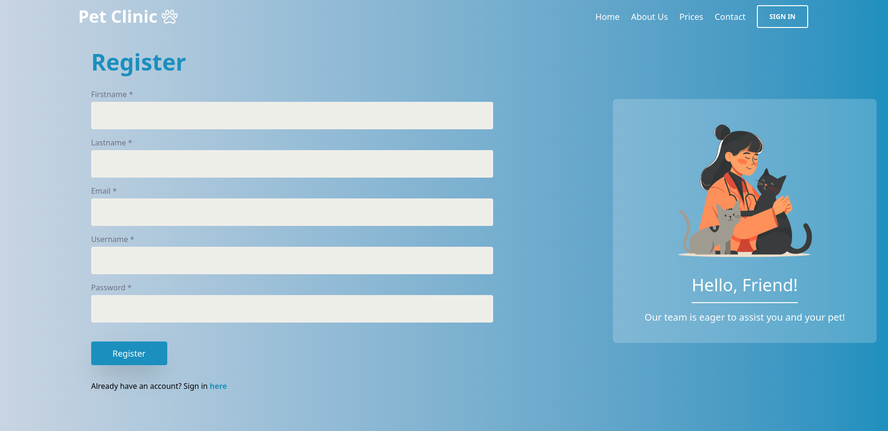

# Pet Clinic Appointment App

### Overview

A veterinary clinic management system built with Spring Boot and React that streamlines pet healthcare management. The application serves both veterinary professionals and pet owners, providing a platform for managing pet records, scheduling appointments, and tracking treatment histories. Pet owners can register pets and manage visits, while veterinarians can oversee appointments and maintain medical records. Built with modern technologies and featuring secure authentication, the system ensures efficient management of pet healthcare services.

## Features

- User Authentication & Authorization

  - JWT-based authentication
  - Role-based access control (Admin, Doctor, User)

    
    

- Pet Management

  - Add and update pet information
  - View pet's visit history
  - Track pet medical history

  
  

- Visit Management

  - Schedule veterinary appointments
  - Manage visits (Edit/Cancel)
  - Track visit history

  

## Technology Stack

### Backend

- Java 21
- Spring Boot 3
- Spring Security
- AWS DynamoDB
- JWT Authentication
- RESTful API

### Frontend

- React
- JavaScript
- Tailwind CSS
- React Router
- Axios
- Context API for State Management

## API Endpoints

### Authentication

- POST `/api/v1/auth/register` - Register new user
- POST `/api/v1/auth/login` - User login
- POST `/api/v1/auth/logout` - User logout

### Pets

- POST `/api/v1/pets/add` - Create new pet
- GET `/api/v1/pets/{petId}` - Get pet details
- GET `/api/v1/pets/user/{userId}` - Get user pets
- PATCH `/api/v1/pets/{petId}` - Update pet information
- DELETE `/api/v1/pets/{petId}` - Delete pet

### Visits

- POST `/api/v1/visits/add` - Schedule new visit
- GET `/api/v1/visits/all` - Get all visits
- GET `/api/v1/visits/{visitId}` - Get visit details
- GET `/api/v1/visits/user/{userId}` - Get user visit details
- PATCH `/api/v1/visits/{visitId}` - Update visit information
- DELETE `/api/v1/visits/{visitId}` - Cancel visit
- POST `/api/v1/visits/{visitId}/details` - Create visit details
- PATCH `/api/v1/visits/{visitId}/updateDetails` - Update visit details
- PATCH `/api/v1/visits/{visitId}/status` - Update visit status

## Getting Started

1. Clone the repository
2. Configure AWS credentials:
   - Create `.aws` folder at your home directory
   - Inside `.aws` folder create `credentials` file (without .txt)
   - Add your credentials:
     ```bash
     [default]
     aws_access_key_id = your-access-key-id
     aws_secret_access_key = your-secret-access-key
     ```
3. Set up DynamoDB tables
4. Backend setup:
   - Open and configure database credentials at `application.properties`
   - Run `mvn clean install`
   - Run `mvn spring-boot:run`
5. Frontend setup:
   - Navigate to frontend: `cd frontend`
   - Install dependencies: `npm i`
   - Start the application: `npm run dev`

## Links

 [🔗 Miro Board](https://miro.com/app/board/uXjVLk2JWUw=/)


## Team

| DEV
|-----------------------------------------------------|
|[Eglė Juknevičiūtė](https://github.com/eglereact) |
|[Žydrūnas Daukšas](https://github.com/ZeyDy) |
|[Ovidijus Eitminavičius](https://github.com/Ovii2) |
|[Renata V.](https://github.com/Renseva) |
